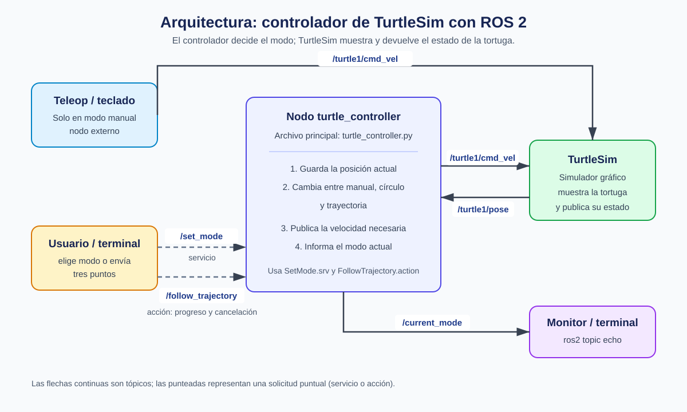

# Control de TurtleSim con ROS 2

Este proyecto controla la tortuga de TurtleSim en tres modos:

- **Manual:** se mueve con las flechas del teclado.
- **Círculo:** gira de forma automática en sentido horario o antihorario.
- **Trayectoria:** visita tres puntos y permite cancelar el recorrido.

## Arquitectura



La idea puede resumirse en cuatro pasos:

1. TurtleSim publica la posición de la tortuga en `/turtle1/pose`.
2. `turtle_controller` guarda esa posición y revisa el modo seleccionado.
3. El controlador calcula el movimiento necesario.
4. La velocidad se envía a TurtleSim mediante `/turtle1/cmd_vel`.

En modo manual, el teclado publica directamente la velocidad. El servicio
`/set_mode` activa el modo manual o el círculo. La acción
`/follow_trajectory` recibe los tres puntos, informa el avance y permite
cancelar el recorrido. El tópico `/current_mode` informa el modo activo.

## Archivos que se escribieron para la práctica

| Archivo | Función |
| --- | --- |
| `controlador_tortuga/controlador_tortuga/turtle_controller.py` | Contiene la lógica del movimiento. |
| `controlador_tortuga_interfaces/srv/SetMode.srv` | Define cómo solicitar un cambio de modo. |
| `controlador_tortuga_interfaces/action/FollowTrajectory.action` | Define los tres puntos, el progreso y el resultado. |

Los demás archivos, como `package.xml`, `setup.py` y `CMakeLists.txt`, son
archivos de configuración que ROS 2 necesita para reconocer y compilar los
paquetes.

Las carpetas `build`, `install` y `log` **no se guardan en GitHub**. ROS 2 las
crea automáticamente al ejecutar `colcon build`.

## Compilar

Desde una terminal de Ubuntu:

```bash
cd ~/robotica_ws
source /opt/ros/kilted/setup.bash
colcon build --symlink-install
source install/setup.bash
```

## Ejecutar

### Terminal 1: abrir TurtleSim

```bash
source /opt/ros/kilted/setup.bash
ros2 run turtlesim turtlesim_node
```

### Terminal 2: ejecutar el controlador

```bash
source /opt/ros/kilted/setup.bash
source ~/robotica_ws/install/setup.bash
ros2 run controlador_tortuga turtle_controller
```

### Terminal 3: mover con el teclado

```bash
source /opt/ros/kilted/setup.bash
ros2 run turtlesim turtle_teleop_key
```

## Cambiar de modo

Círculo horario:

```bash
ros2 service call /set_mode controlador_tortuga_interfaces/srv/SetMode "{modo: 'circulo', horario: true}"
```

Círculo antihorario:

```bash
ros2 service call /set_mode controlador_tortuga_interfaces/srv/SetMode "{modo: 'circulo', horario: false}"
```

Regresar al modo manual:

```bash
ros2 service call /set_mode controlador_tortuga_interfaces/srv/SetMode "{modo: 'manual', horario: false}"
```

## Recorrer tres puntos

```bash
ros2 action send_goal --feedback /follow_trajectory controlador_tortuga_interfaces/action/FollowTrajectory "{puntos_x: [2.0, 8.0, 5.0], puntos_y: [2.0, 2.0, 8.0]}"
```

La acción visita los puntos en el orden recibido. Para cancelarla se presiona
`Ctrl+C` en la terminal que envió la trayectoria. Después de terminar o
cancelar, el programa regresa al modo manual.

## Consultar el modo actual

```bash
ros2 topic echo /current_mode
```

## Video de demostración

[Enlace del video](docs/VIDEO.md)
